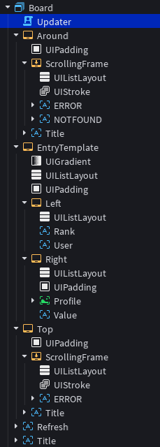
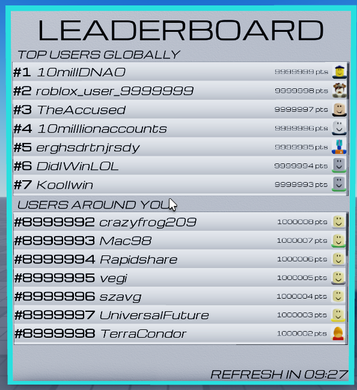

## Setup
Now let's make the LocalScript that actually displays all the information to the user. This part does not really involve RankSwift as a module, but it does go over the format of some of the data it provides, and suggests a good way to display the information. Feel free to skip this part and make it on your own. For reference of the datatypes you'll be working with, check the return types of the functions we used in the ServerScript page and the types section in either the [Basic Usage Page](../basic-usage.md) or the [Complete API](../Advanced-Usage/complete-API.md).

This code will use a preset gui layout as shown below:



This gui layout will be present in the [Template File](../../assets/TutorialPlace.rbxl){:download="TutorialPlace.rbxl"} provided in the [Overview Page](./overview.md), but you should be able to adapt this code to work with any gui.

We'll be using a LocalScript called `Updater` in the `Board` SurfaceGui. Let's start by difining some helpful constants:

```lua
local ReplicatedStorage = game:GetService("ReplicatedStorage")
local RunService = game:GetService("RunService")
local Players = game:GetService("Players")
local REMOTES = ReplicatedStorage.BoardRemotes
local GUI = script.Parent

local ENTRY_TEMPLATE = GUI.EntryTemplate
local BOARD_VALUE_SUFFIX = " pts"
local TOP_SCROLL = GUI.Top.ScrollingFrame
local AROUND_SCROLL = GUI.Around.ScrollingFrame
local REFRESH_TIMER = GUI.Refresh

-- these are error messages we can display if the server fails to retrieve certain information
local TOP_ERR = TOP_SCROLL.ERROR
local AROUND_ERR = AROUND_SCROLL.ERROR
local AROUND_NF = AROUND_SCROLL.NOTFOUND
```

## Username and Profile Picture Retrieval
RankSwift stored and provided UserIds, but we'll want to show usernames and avatar headshots. Luckily, Roblox gives us some helpful APIs for getting these. Let's write a quick function that will load those onto an entry frame. It'll be a good idea to cache usernames and headshots as well to prevent making more retrievals than we have to.

```lua
local name_cache: {[number]: string} = {}
local profile_cache: {[number]: string} = {}

function load_entry_name_profile(id: number, frame: typeof(ENTRY_TEMPLATE))
    if name_cache[id] then -- If the name is cached, then we can just display that.
		frame.Left.User.Text = name_cache[id]
	else
        -- Put this in a task.spawn so that we don't hang things up. This will let
        -- this retrieval run in the background.
		task.spawn(function()
            -- Retrieve the name and cache it for future use.
			local name = Players:GetNameFromUserIdAsync(id)
			name_cache[id] = name
			
            -- Make sure the frame hasn't been destroyed.
            -- The frame may be destroyed if the board refreshes
            -- during retrieval, so it's good to do this so that
            -- our output isn't flooded with error messages
			if not frame.Parent then
				return
			end
			
            -- display the username
			frame.Left.User.Text = name
		end)
	end

    -- same logic as the name cache
    if profile_cache[id] then
		frame.Right.Profile.Image = profile_cache[id]
	else
		task.spawn(function()
			local image = Players:GetUserThumbnailAsync(
				id,
				Enum.ThumbnailType.HeadShot,
				Enum.ThumbnailSize.Size100x100
			)
			profile_cache[id] = image
			
			if not frame.Parent then
				return
			end
			
			frame.Right.Profile.Image = image
		end)
	end
end
```

## Displaying the Top Users
Whenever the RemoteEvent `TopUpdate` fires, we need to update the top users on our GUI. We can do this by deleting any old entry frames, then create new entry frames for each user, loading usernames and avatar headshots as we go. We'll want to keep a list of all our top entry frames so that we can destroy them all on update. Before we write any code, let's look at the return type of `board:GetTop()`, the method we use on the server-side to get the information to give the client. According to the API, it returns `{BoardEntry}?`. It will return `nil` if the server failed to retrieve the top users, or just hasn't retrieved it yet. In this case, we can display our `TOP_ERR` error message. But what is the `BoardEntry` type? The API describes it as follows:

```lua
type Entry = {
	key: number,
	points: number,
	timestamp: number
}

type BoardEntry = {
	rank: number,
	entry: Entry
}
```

So really, this is the return type:

```lua
type TopReturnType = {
	{
		rank: number,
		entry: {
			key: number,
			points: number,
			timestamp: number
		}
	}
}?
```

Now let's use that to display some information.

```lua
local top_entries: {Frame} = {}

REMOTES.TopUpdate.OnClientEvent:Connect(function(entries)
	-- Delete all old entries, we're creating new ones.
	for _, entry in top_entries do
		entry:Destroy()
	end
	
	table.clear(top_entries)
	
	-- If the server gave us nil, then the top entries failed to retreive,
	-- so let's just show an error message.
	if not entries then
		TOP_ERR.Visible = true
		return
	end
	
	-- Make sure to hide the error message so it doesn't show when everything
	-- is fine.
	TOP_ERR.Visible = false
	
	-- Add all the top entries.
	for _, entry in entries do
		-- Create the Entry frame and put it in our scrolling frame.
		local frame = ENTRY_TEMPLATE:Clone()
		frame.Visible = true
		frame.Parent = TOP_SCROLL
		frame.Name = entry.rank
		
		-- Retrieve some important information from what the server gave us.
		local rank = entry.rank
		local id = entry.entry.key
		local points = entry.entry.points
		
		-- Set the layout order so everything displays in order.
		frame.LayoutOrder = rank

		-- Update the text labels.
		frame.Left.Rank.Text = `#{rank}`
		frame.Right.Value.Text = `{points}{BOARD_VALUE_SUFFIX}`
		
		-- Put a placeholder for the name value, and have the actual name
		-- and profile picture retrieve in the background with the function
		-- we wrote before.
		frame.Left.User.Text = "--"
		load_entry_name_profile(id, frame)
		
		-- Make sure to add it to our list so it is properly destroyed next
		-- refresh.
		table.insert(top_entries, frame)
	end
end)
```

## Displaying the Users Around You
This part will be pretty similar, but with one key difference: YOU'RE on it. We'll want to bold your entry so it's easier to find. If you're not on the leaderboard, we'll treat that as a special case, and deal with that later. Let's look at the type we're dealing with. `board:GetIdInfo(id)` returns `(boolean, IdData?)`. Refering to the API, we see that our IdData type is this:

```lua
type IdData = {
	rank: number,
	entry: Entry,
	surrounding_entries: {BoardEntry}?
}
```

Note that `surrounding_entries` can be `nil`. This is rare, and should only happen in edge cases, but we should consider that possibility, just in case. Let's look at what that boolean means though. That boolean shows whether or not the server *has* data about the entry. If it's `false`, the server has either never tried to retrieve your data, or the request failed when it tried. If this happens, we can show an error message. Even if it's `true`, however, `data` can be nil. This will happen if the server successfully retrieved your data but found out that you're not on the board. We'll handle that case in more detail later.

```lua
local around_entries: {Frame} = {}

REMOTES.AroundUpdate.OnClientEvent:Connect(function(cached, data)
	-- Delete old entries.
	for _, entry in around_entries do
		entry:Destroy()
	end

	table.clear(around_entries)

	-- Display an error message if the data was not retrieved.
	if not cached then
		AROUND_ERR.Visible = true
		return
	end

	-- Hide error messages when we don't need them.
	AROUND_ERR.Visible = false
	AROUND_NF.Visible = false -- This one we'll toggle later in the code.
	
	if not data then
		-- TODO: WRITE THIS NEXT
		return
	end

	-- In that edge case we mentioned before, surrounding_entries would be nil,
	-- so let's just display your entry and nothing else. But wait! "data" is
	-- of type IdData, but data.surrounding_entries has entries of BoardEntry!
	-- This is true, however, all the information in BoardEntry is also in IdData,
	-- (ex: rank, entry) so we can treat IdData like a BoardEntry and ignore the
	-- extra information.
	local display_entries = data.surrounding_entries or {data}

	-- this part is basically the same from before
	for _, entry in display_entries do
		local frame = ENTRY_TEMPLATE:Clone()
		frame.Visible = true
		frame.Parent = AROUND_SCROLL -- put it in the around scroll frame this time
		frame.Name = entry.rank

		local rank = entry.rank
		local id = entry.entry.key
		local points = entry.entry.points

		frame.LayoutOrder = rank
		frame.Left.Rank.Text = `#{rank}`
		frame.Left.User.Text = "--"
		frame.Right.Value.Text = `{points}{BOARD_VALUE_SUFFIX}`
		
		-- If this is our entry, bold it so that it stands out. 
		if id == Players.LocalPlayer.UserId then
			frame.Left.User.FontFace = Font.new(frame.Left.User.FontFace.Family, Enum.FontWeight.Bold)
		end

		load_entry_name_profile(id, frame)

		table.insert(around_entries, frame)
	end
end)
```

Now, except for that big `-- TODO: WRITE THIS NEXT`, the update around code is done. What do we want to do for that TODO though? This is for the case where the server knows for sure that you're NOT on the board. This means you're probably doing worse than the worst player on the board, so we can say that your rank is greater than the board size and leave it at that. It's not much information, but it should give the player some sort of baseline. Chances are though, if your board is any reasonable size, any player that actually cares about the game will be on the board anyway, but it's still nice to display something here. If we want to say that your rank is greater than the board size, we'll need the board size. Luckily, thats part of the information we send on board refresh! Let's write this part of our board refresh code:

```lua
local board_size: number? = nil

REMOTES.RefreshUpdate.OnClientEvent:Connect(function(target_time, size)
	board_size = size
	
	-- TODO: Handle target_time
end)
```

Now we can go back to our update around code and fix that nasty TODO.

```lua
-- We'll be keeping track of the entry frame in this special case.
-- I'll explain why in a moment.
local out_of_bounds_frame: typeof(ENTRY_TEMPLATE)? = nil

REMOTES.AroundUpdate.OnClientEvent:Connect(function(cached, data)
	-- Clear out the variable pointing to the frame for this special case,
	-- it was destroyed in the for loop destroying everything in around_entries.
	out_of_bounds_frame = nil

	-- All the same...

	AROUND_NF.Visible = false -- Remember when I said we'd need this? This is why!
	
	-- data is nil but because of a previous if statement, we know that
	-- the server has checked if you're on the board (cached == true),
	-- so you must not be on the board.
	if not data then
		-- In case the other remote event hasn't told us the board size yet...
		if not board_size then
			-- Display an error saying that you were not found on the board.
			AROUND_NF.Visible = true
		else
			-- Just display stuff like normal
			local frame = ENTRY_TEMPLATE:Clone()
			frame.Visible = true
			frame.Parent = AROUND_SCROLL
			frame.Name = "FAIL"

			-- Show that your rank is greater than the board size.
			frame.Left.Rank.Text = `>{board_size}`
			frame.Left.User.Text = "--"

			-- Don't show a score because the server didn't give us one.
			frame.Right.Value.Visible = false
			
			load_entry_name_profile(Players.LocalPlayer.UserId, frame)
			
			-- Save this frame so we can reference it later
			out_of_bounds_frame = frame

			-- Make sure to add it to our around_entries list so it's properly
			-- cleaned up on refresh.
			table.insert(around_entries, frame)
		end
		
		return
	end
	
	-- All the same...
end)
```

This will work, but with one caveat. What if the board size changes in between around updates? What if the board_size gets retrieved right after this? We'll need to be able to update that rank text label on demand, and even create this frame late. We added that `out_of_bounds_frame` variable exactly so that we could update that text label late, so that part is covered. For the other part, let's just move the part that creates the frame into a function so we can call it in multiple places.

```lua
-- We'll want to make sure to only call this when we know that board_size is not nil.
function display_out_of_bounds_frame()
	local frame = ENTRY_TEMPLATE:Clone()
	frame.Visible = true
	frame.Parent = AROUND_SCROLL
	frame.Name = "FAIL"

	frame.Left.Rank.Text = `>{board_size}`
	frame.Left.User.Text = "--"
	frame.Right.Value.Visible = false
	
	load_entry_name_profile(Players.LocalPlayer.UserId, frame)
	
	out_of_bounds_frame = frame
	table.insert(around_entries, frame)
end

REMOTES.AroundUpdate.OnClientEvent:Connect(function(cached, data)
	-- All the same...

	if not data then
		if not board_size then
			AROUND_NF.Visible = true
		else
			-- Call the function here
			display_out_of_bounds_frame()
		end
		
		return
	end
	
	-- All the same...
end)
```

Now, let's go back to our RefreshUpdate connection and add some stuff.

```lua
REMOTES.RefreshUpdate.OnClientEvent:Connect(function(target_time, size)
	board_size = size

	if out_of_bounds_frame then
		-- we already have the frame and want to update the rank label
		out_of_bounds_frame.Left.Rank.Text = `>{board_size}`
	elseif AROUND_NF.Visible then
		-- we previously didn't have a board_size, so it just displayed an error
		-- because we weren't on the board, so let's display our out of bounds frame
		-- with the newly acquired board_size.
		AROUND_NF.Visible = false
		display_out_of_bounds_frame()

	end

	-- TODO: Handle target_time
end)
```

Perfect, now the updating the users around you should work!

## Displaying the Refresh Timer
Now, as a last cherry on top, let's put a timer in the corner showing how long it'll be until the next board refresh. Let's keep a variable of when the next refresh will be.

```lua
local refresh_target: number? = nil

REMOTES.RefreshUpdate.OnClientEvent:Connect(function(target_time, size)
	-- All the same...

	refresh_target = target_time
end)

RunService.RenderStepped:Connect(function()
	-- In case we don't know when the next refresh is, hide the timer.
	if not refresh_target then
		REFRESH_TIMER.Text = ""
		return
	end
	
	-- Calculate how much time we have until the next refresh. On the server,
	-- we put the time in terms of workspace:GetServerTimeNow(), so we should
	-- use that here too. We'll also make sure the timer doesn't go negative
	-- right before a refresh making the timer display weirdly.
	local delta = math.max(refresh_target - workspace:GetServerTimeNow(), 0)

	-- Calculate how many seconds and minutes there are.
	local seconds = math.floor(delta%60)
	local minutes = math.floor(delta/60)
	
	-- Show the timer with minutes and seconds padded with zeros to have two digits.
	REFRESH_TIMER.Text = string.format("REFRESH IN %02i:%02i", minutes, seconds)
end)
```

## Final Code
Anddd we're done!



Of course, this is with a leaderboard that has been populated with 10 million dummy entries, and with myself inserted into the middle, but this is what the result should look like in terms of UI.

Here's our full final code:

```lua
local ReplicatedStorage = game:GetService("ReplicatedStorage")
local RunService = game:GetService("RunService")
local Players = game:GetService("Players")
local REMOTES = ReplicatedStorage.BoardRemotes
local GUI = script.Parent

local ENTRY_TEMPLATE = GUI.EntryTemplate
local BOARD_VALUE_SUFFIX = " pts"
local TOP_SCROLL = GUI.Top.ScrollingFrame
local AROUND_SCROLL = GUI.Around.ScrollingFrame
local REFRESH_TIMER = GUI.Refresh
local TOP_ERR = TOP_SCROLL.ERROR
local AROUND_ERR = AROUND_SCROLL.ERROR
local AROUND_NF = AROUND_SCROLL.NOTFOUND

-- main code
local refresh_target: number? = nil
local board_size: number? = nil
local top_entries: {Frame} = {}
local around_entries: {Frame} = {}
local name_cache: {[number]: string} = {}
local profile_cache: {[number]: string} = {}
local out_of_bounds_frame: typeof(ENTRY_TEMPLATE)? = nil

function load_entry_name_profile(id: number, frame: typeof(ENTRY_TEMPLATE))
	if name_cache[id] then
		frame.Left.User.Text = name_cache[id]
	else
		task.spawn(function()
			local name = Players:GetNameFromUserIdAsync(id)
			name_cache[id] = name
			
			if not frame.Parent then
				return
			end
			
			frame.Left.User.Text = name
		end)
	end

	if profile_cache[id] then
		frame.Right.Profile.Image = profile_cache[id]
	else
		task.spawn(function()
			local image = Players:GetUserThumbnailAsync(id, Enum.ThumbnailType.HeadShot, Enum.ThumbnailSize.Size100x100)
			profile_cache[id] = image
			
			if not frame.Parent then
				return
			end
			
			frame.Right.Profile.Image = image
		end)
	end
end

function display_out_of_bounds_frame()
	local frame = ENTRY_TEMPLATE:Clone()
	frame.Visible = true
	frame.Parent = AROUND_SCROLL
	frame.Name = "FAIL"

	frame.Left.Rank.Text = `>{board_size}`
	frame.Left.User.Text = "--"
	frame.Right.Value.Visible = false

	load_entry_name_profile(Players.LocalPlayer.UserId, frame)

	out_of_bounds_frame = frame
	table.insert(around_entries, frame)
end

REMOTES.TopUpdate.OnClientEvent:Connect(function(entries)
	for _, entry in top_entries do
		entry:Destroy()
	end
	
	table.clear(top_entries)
	
	if not entries then
		TOP_ERR.Visible = true
		return
	end
	
	TOP_ERR.Visible = false
	
	for _, entry in entries do
		local frame = ENTRY_TEMPLATE:Clone()
		frame.Visible = true
		frame.Parent = TOP_SCROLL
		frame.Name = entry.rank
		
		local rank = entry.rank
		local id = entry.entry.key
		local points = entry.entry.points
		
		frame.LayoutOrder = rank
		frame.Left.Rank.Text = `#{rank}`
		frame.Left.User.Text = "--"
		frame.Right.Value.Text = `{points}{BOARD_VALUE_SUFFIX}`
		
		load_entry_name_profile(id, frame)
		
		table.insert(top_entries, frame)
	end
end)

REMOTES.AroundUpdate.OnClientEvent:Connect(function(cached, data)
	for _, entry in around_entries do
		entry:Destroy()
	end
	
	out_of_bounds_frame = nil

	table.clear(around_entries)

	if not cached then
		AROUND_ERR.Visible = true
		return
	end

	AROUND_ERR.Visible = false
	AROUND_NF.Visible = false
	
	if not data then
		if not board_size then
			AROUND_NF.Visible = true
		else
			display_out_of_bounds_frame()
		end
		
		return
	end
	
	local display_entries = data.surrounding_entries or {data}
	for _, entry in display_entries do
		local frame = ENTRY_TEMPLATE:Clone()
		frame.Visible = true
		frame.Parent = AROUND_SCROLL
		frame.Name = entry.rank

		local rank = entry.rank
		local id = entry.entry.key
		local points = entry.entry.points

		frame.LayoutOrder = rank
		frame.Left.Rank.Text = `#{rank}`
		frame.Left.User.Text = "--"
		frame.Right.Value.Text = `{points}{BOARD_VALUE_SUFFIX}`
		
		if id == Players.LocalPlayer.UserId then
			frame.Left.User.FontFace = Font.new(frame.Left.User.FontFace.Family, Enum.FontWeight.Bold)
		end

		load_entry_name_profile(id, frame)

		table.insert(around_entries, frame)
	end
end)

REMOTES.RefreshUpdate.OnClientEvent:Connect(function(target_time, size)
	board_size = size

	if out_of_bounds_frame then
		out_of_bounds_frame.Left.Rank.Text = `>{board_size}`
	elseif AROUND_NF.Visible then
		AROUND_NF.Visible = false
		display_out_of_bounds_frame()
	end
	
	refresh_target = target_time
end)

RunService.RenderStepped:Connect(function()
	if not refresh_target then
		REFRESH_TIMER.Text = ""
		return
	end
	
	local delta = math.max(refresh_target - workspace:GetServerTimeNow(), 0)
	local seconds = math.floor(delta%60)
	local minutes = math.floor(delta/60)
	
	REFRESH_TIMER.Text = string.format("REFRESH IN %02i:%02i", minutes, seconds)
end)
```