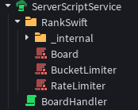
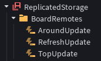

## Setup

We'll start by making a ServerScript in our ServerScriptService. For this example, we'll call it `BoardHandler`. We'll need the RankSwift package. You can get it [here](https://create.roblox.com/store/asset/120356645529088){:target="_blank"}. Once you have it, import it from the toolbox and put it into ServerScriptService with `BoardHandler`.



We'll also need some RemoteEvents in this, so we'll make a Folder in ReplicatedStorage for that. For this example, we'll call it `BoardRemotes`. We'll add remotes to it as we go. If you are using the example place file, then the remotes will already be in there.

Let's open up `BoardHandler`. We'll need to get a few things. We'll need the Board module from the RankSwift folder, we'll want a reference to our `BoardRemotes` folder, and we'll want `Players`.

```lua
local ServerScriptService = game:GetService("ServerScriptService")
local Players = game:GetService("Players")
local ReplicatedStorage = game:GetService("ReplicatedStorage")
local Remotes = ReplicatedStorage.BoardRemotes

local Board = require(ServerScriptService.RankSwift.Board)
```

## Creating the Board Object

Now, before we create our board object, we'll need a configuration. Since we're not doing anything too fancy, we can leave the automatic player tracking on. This should simplify things a bit. We want to track the top **25** users, the **10** users before each player, and the **10** users after each player, so our config will look like this:

```lua
local config = Board.DefaultConfig()

-- If you want to change the refresh rate, set this.
-- For this example, we'll leave it at the default 10 minutes.
-- config.board_update_delay = 

config.retrieve_top = 25
config.board_track_before = 10
config.board_track_after = 10
```

!!! info "Default Config"
    Note that `config.immediately_retrieve_newly_tracked_ids` and `config.automatically_track_player_ids` are both on by default. We need these to be true for the following code to work as intended. The former will make sure we are retrieving information about all players in our game, and the latter will make sure players have their information immediately available.

Now we can create our board object. You'll need to already have your server's IP address, port, and API key for this.

```lua
local board = Board.LoadBoardAsync(
    "123.45.678.910", -- set this to your server's IP
    3895, -- this is the default port, change it if you changed it on your server
    "api-key", -- make this your api key. You can put a secret from HTTPService here if you want
    config
)
```

## Remote Events

Our board will already be connected and running! Let's think about what information we'll want to pass on to clients. We'll want to tell them when the top entries of the board update, we'll want to tell them when the users around them updates, and we'll want to tell them when the board refreshes. The first two are self explanatory, but the last thing we are doing so that 1. we can display the time until the next update, and 2. so that we can inform the client of the size of the leaderboard. You'll see why we're doing that later.

Let's create Remote events for this. We'll create a RemoteEvent called `RefreshUpdate` in our `BoardRemotes` folder for when the board updates, a RemoteEvent called `AroundUpdate`, and a RemoteEvent called `TopUpdate`.



When we inform a player of a board refresh, we'll want to send them the timestamp that the board will refresh next, and we'll want to send them the board's size. So, we can write a function like this:

```lua
function player_refresh(plr)
	Remotes.RefreshUpdate:FireClient(plr,
		workspace:GetServerTimeNow() + board:TimeUntilRefresh(),
		board:GetBoardInfo().size
	)
end
```

The timestamp of the next refresh will be the current timestamp plus the time until the next refresh. We will use `workspace:GetServerTimeNow()` for a synced timestamp. The size of the board is included in a board's "BoardInfo" struct, which we can get with `board:GetBoardInfo()`.

For the top users, the function will be much more simple.
```lua
function player_top(plr)
	Remotes.TopUpdate:FireClient(plr, board:GetTop())
end
```
All we're doing here is sending the player the top entries, simple as that.

Since we have `config.board_track_after = 10` and `config.board_track_before = 10`, the cached information for players should include the players around them. So, all we need to do to get the users around a player is to get their cached information. This will also have the player's rank and entry. So, our last function will look like this:

```lua
function player_around(plr)
	Remotes.AroundUpdate:FireClient(plr, board:GetIdInfo(plr.UserId))
end
```

!!! Warning "Cached Information Can Be Nil"
    The return value of `GetTop` and `GetIdInfo` can both be nil if a request to your server failed or if the data just isn't cached yet. We'll handle these cases on the client side.

Now that we have functions to inform players of new information, we need to hook them up to events so that this information actually gets sent. We need to send players new information about the board refresh whenever the board updates/refreshes. Luckily, we have an event for that called `board_updated`.

```lua
board.board_updated:Connect(function()
	for _, plr in Players:GetPlayers() do
		player_refresh(plr)
	end
end)
```

For the top users, we also have an event called `top_cache_changed`. Usually this is equivalent to `board_updated`, since board updates update the top users cache, but there are some edge cases where the top cache will change outside of a board update. We do not *need* to account for this edge case in this example since we do not have any async requests, but for the sake of good practice, we'll do it anyway.

```lua
board.top_cache_changed:Connect(function()
	for _, plr in Players:GetPlayers() do
		player_top(plr)
	end
end)
```

And finally, we need to tell players when the information about the users around them updates. We also have an event for this. The `id_cache_changed` event fires whenever a user's cached information changes -- whenever new information is retrieved about the user and the users around them. The event passes two values: the user id whose cache was updated, and their new IdInfo. We will not need the latter of these, however, since our `player_around` function gets the IdInfo itself.

```lua
board.id_cache_changed:Connect(function(id, data)
	local plr = Players:GetPlayerByUserId(id)
	if not plr then
		return
	end
	
	player_around(plr)
end)
```

Now, the last thing we need to do is make sure that this information is immediately available to players by sending it to them when they join the game.

```lua
Players.PlayerAdded:Connect(player_refresh)
Players.PlayerAdded:Connect(player_top)
Players.PlayerAdded:Connect(player_around)
```

Careful though! We called `LoadBoardAsync` in this script which yields. It's possible that a player has already loaded into our game by the point that we connect these events, so to be safe, we'll also loop through all players already in the game and send them the information.

```lua
for _, plr in Players:GetPlayers() do
	player_refresh(plr)
	player_top(plr)
	player_around(plr)
end
```

Perfect! That's the server-side code done. The keen observer may have noticed that, even though we have `config.immediately_retrieve_newly_tracked_ids` set to `true` by default, the request to retrieve that information yields, so by the time the `player_around` function is called by the `PlayerAdded` event, the player's IdInfo may not have been retrieved yet. This is true, however, when the information does eventually successfully retrieve, the `id_cache_changed` event will fire for that id, and we'll end up sending them the initial information anyway.

## Final Code

Here is our complete code:

```lua
local ServerScriptService = game:GetService("ServerScriptService")
local Players = game:GetService("Players")
local ReplicatedStorage = game:GetService("ReplicatedStorage")
local Remotes = ReplicatedStorage.BoardRemotes

local Board = require(ServerScriptService.RankSwift.Board)

local config = Board.DefaultConfig()

config.retrieve_top = 25
config.board_track_before = 10
config.board_track_after = 10

local board = Board.LoadBoardAsync("123.45.678.910", 3895, "api-key", config)

function player_refresh(plr)
	Remotes.RefreshUpdate:FireClient(plr,
		workspace:GetServerTimeNow() + board:TimeUntilRefresh(),
		board:GetBoardInfo().size
	)
end

function player_top(plr)
	Remotes.TopUpdate:FireClient(plr, board:GetTop())
end

function player_around(plr)
	Remotes.AroundUpdate:FireClient(plr, board:GetIdInfo(plr.UserId))
end

board.board_updated:Connect(function()
	for _, plr in Players:GetPlayers() do
		player_refresh(plr)
	end
end)

board.top_cache_changed:Connect(function()
	for _, plr in Players:GetPlayers() do
		player_top(plr)
	end
end)

board.id_cache_changed:Connect(function(id, data)
	local plr = Players:GetPlayerByUserId(id)
	if not plr then
		return
	end
	
	player_around(plr)
end)

Players.PlayerAdded:Connect(player_refresh)
Players.PlayerAdded:Connect(player_top)
Players.PlayerAdded:Connect(player_around)

for _, plr in Players:GetPlayers() do
	player_refresh(plr)
	player_top(plr)
	player_around(plr)
end
```

Great, now we can move onto the LocalScript that displays all this information. Click [here](./localscript.md) to go there.